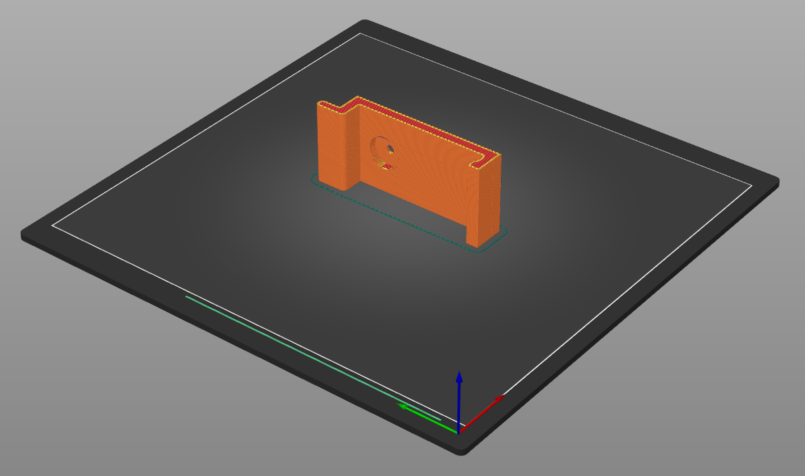
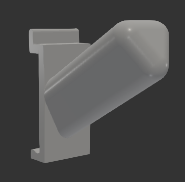
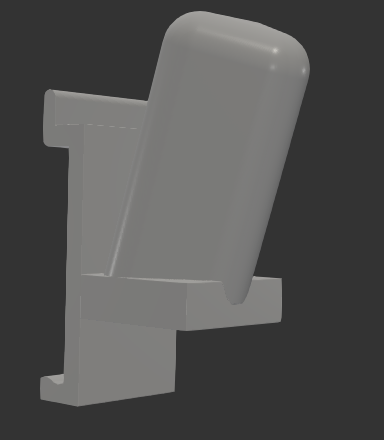

# HandiWALL mounts

`parts.py` contains the base mount that can be clipped to the HandiWALL statwall system, as well as multiple holders that are based on it.

Here is how the clamping works:

I recommend to print them on the side so that tension forces will work along filament lines. All holders can be printed without supports:

## Bosch 12V powertool holders

Two variations, one that is more suitable for drills, screwdrivers etc:

and the other for longer and narrower tools (rotary tool etc):

